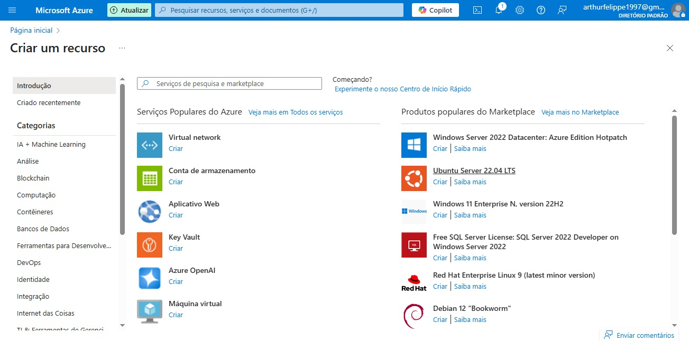
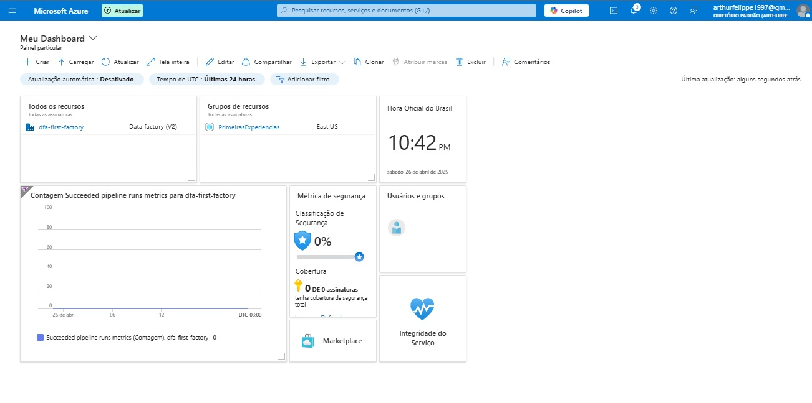
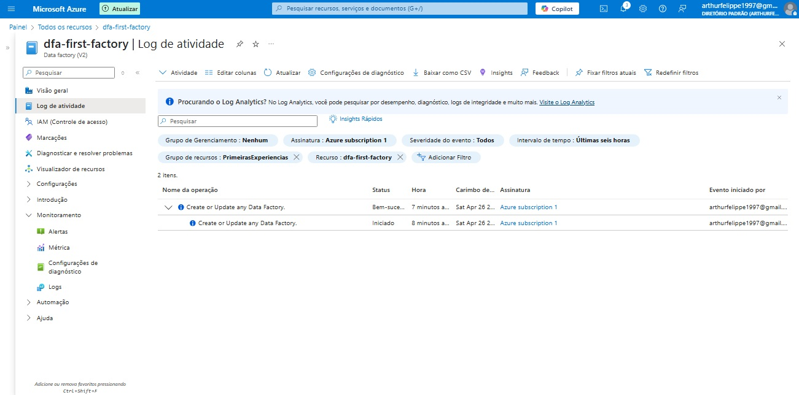
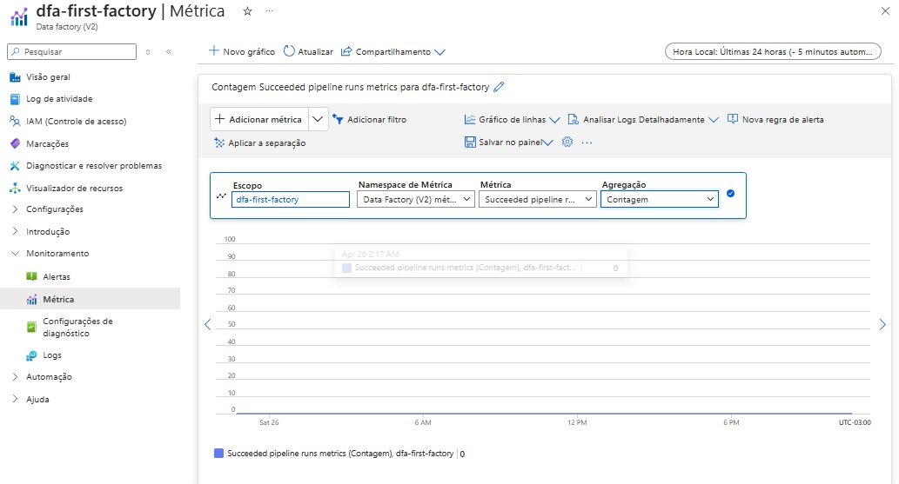

# 🚀 Aprendizado sobre Microsoft Azure

Este repositório documenta os principais aprendizados adquiridos durante o módulo de estudos "Criando um Monitoramento de Custos no Data Factory", com foco na criação e gestão de recursos, dashboards, Data Factory e métricas personalizadas.

---

## 📚 Sumário

- [Criação de Recursos no Azure](#1-criação-de-recursos-no-azure)
- [Configuração de Dashboards](#2-configuração-de-dashboards)
- [Criação e Exploração da Data Factory](#3-criação-e-exploração-da-data-factory)
- [Criação de Métricas Personalizadas](#4-criação-de-métricas-personalizadas)
- [Imagens](#🖼️-imagens)
- [Agradecimento](#💬-agradecimento)

---

## 1. Criação de Recursos no Azure

Aprendi como funciona a criação de recursos dentro do Microsoft Azure, incluindo a organização através de grupos de recursos e o gerenciamento de chaves de acesso.

---

## 2. Configuração de Dashboards

Aprendi a configurar dashboards personalizados no Azure, permitindo uma melhor visualização e monitoramento dos recursos.

---

## 3. Criação e Exploração da Data Factory

Realizamos a criação de uma Azure Data Factory como exemplo prático, explorando as principais abas e funcionalidades disponíveis neste recurso.

---

## 4. Criação de Métricas Personalizadas

Aprendi a criar métricas personalizadas utilizando o Azure Monitor. Um exemplo prático foi a criação de um gráfico que contabiliza o número de execuções de uma pipeline na Data Factory.

---

## 🖼️ Imagens

As imagens exibidas neste `README.md` estão localizadas na pasta `/imagens` deste repositório.

---

## 💬 Agradecimento

Agradeço pela oportunidade de explorar o Microsoft Azure! Este foi um módulo muito enriquecedor para o desenvolvimento das minhas habilidades em Cloud Computing. 🚀✨

---